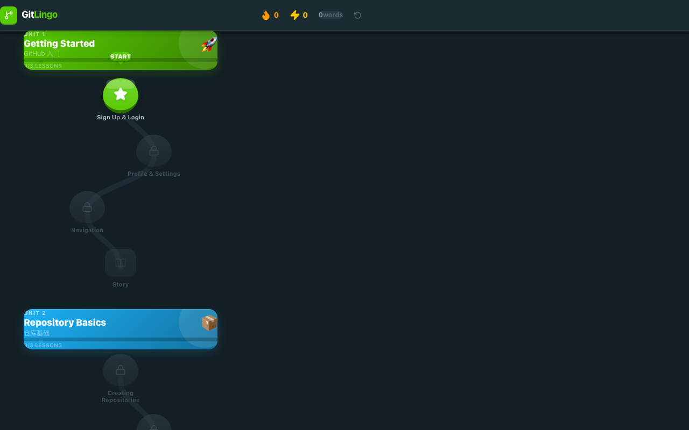
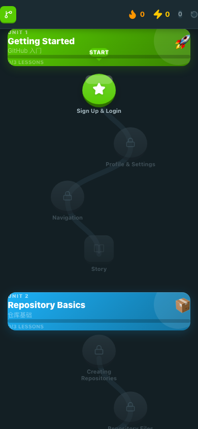
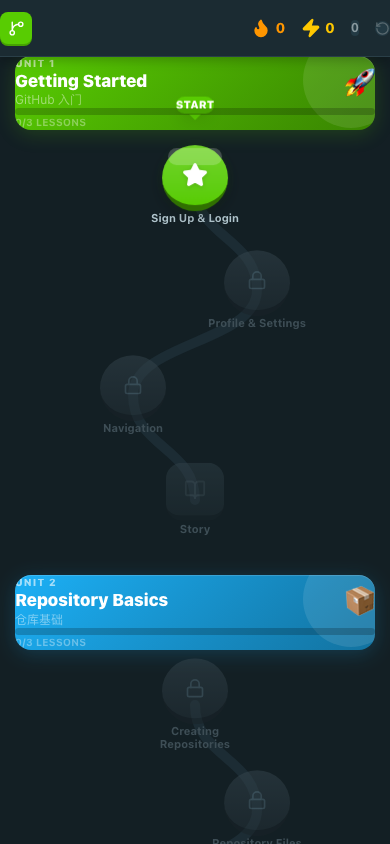

# 🚀 GitLingo - GitHub 开发者英语学习平台

**GitLingo** 是一款专门为开发者设计的、模仿多邻国（Duolingo）交互流程的英语学习 Web 应用。它将你日常在 GitHub 和开发场景中可能遇到的词汇与表述，设计成了**16个渐进式单元（Units）**，涵盖了从最基础的“登录/注册”到复杂的“代码合并”、“版本回滚”和“AI 辅助开发（Copilot）”。

整个课程包含 **385 个核心词汇**、**48 个交互式练习** 以及 **16 个还原真实开发场景的情景对话故事（Stories）**。

---

## 🎨 界面预览 (Screenshots)

### 🖥️ 桌面端 dashboard (三栏自适应布局)


### 📱 移动端学习地图 与 关卡节点
<p align="center">
  
</p>

### ✍️ 交互式多维题型 & 实时发音反馈



---

## ✨ 核心特色 & 还原多邻国交互

1. **多维度自适应题型**：
   - **En ↔ Zh 单选题**：结合上下文例句快速理解。
   - **单词拼写填空（Fill in the blank）**：强化核心代码词汇记忆。
   - **开发者句子拼装（Word bank）**：还原日常提问、提 PR 或写 Commit 的句子结构。
   - **连连看单词配对（Matching pairs）**：练习开发词汇的英汉快速映射。
2. **多邻国式游戏化关卡机制**：
   - **学习地图（Zigzag Path）**：采用平滑贝塞尔曲线连接关卡，每单元包含 3 个基础 Lesson + 1 个 Story。
   - **情景故事模式（Stories）**：还原团队成员（如 Alex、Maya）在 GitHub 进行项目协作、代码合并冲突、提 Issue 时的真实对话交流。
   - **XP 经验系统**、**连续学习天数（Streak）**、以及**完美通关皇冠荣誉（Crown）**。
   - 移除不必要的红心惩罚系统，专注高效记忆。
3. **高频场景发音提醒（TTS）**：
   - 自动适配浏览器最佳英文人声，每当进入练习、点击单词卡片、选对答案或者拼装完句子时，都会**实时高频发音**，加深听觉记忆。
4. **前端响应式适配**：
   - 适配 PC 宽屏、平板与手机移动端。PC 端自动呈现三栏式布局（左侧快捷单元导航、中间滚动关卡图、右侧环形进度指标与连续天数面板），支持点击左侧单元列表平滑滚动定位。
5. **本地无后端持久化**：
   - 所有学习进度、通关得分均在浏览器 LocalStorage 自动保存，无隐私泄露风险。

---

## 📖 单元大纲 (Curriculum Structure)

应用内置 16 个渐进式开发者专属单元：
* **Unit 1**: Getting Started (GitHub 基础注册、个人资料与导航)
* **Unit 2**: Repositories (创建仓库、Clone 与 Public/Private 设置)
* **Unit 3**: Commits (日常 Commit、撰写规范 Message)
* **Unit 4**: Branching (分支管理、Checkout 与 HEAD 指针)
* **Unit 5**: Pull Requests (提 PR、请求 Review、处理 Change Request)
* **Unit 6**: Code Review (代码评审意见、Approve 与 Request Changes)
* **Unit 7**: Merge & Deploy (各种合并策略 Merge/Rebase/Squash 与发布)
* **Unit 8**: Issues & Discussions (提 Bug、创建议题与社区讨论)
* **Unit 9**: Collaboration (Fork/Star/Watch、加 Team 与权限角色)
* **Unit 10**: Advanced Git (Stash、Cherry-pick、Revert、Bisect 二分查找)
* **Unit 11**: Actions & CI/CD (自动化流、Workflow、Trigger 与 Runner)
* **Unit 12**: Security & Packages (漏洞扫描 Dependabot、Token 授权)
* **Unit 13**: CLI & Terminal (命令行词汇、Flags、Verbose 日志)
* **Unit 14**: Documentation (写 Markdown README、Wikis、Changelog)
* **Unit 15**: Organizations (组织账号、Billing 账单、Sponsorship)
* **Unit 16**: Copilot & AI (AI 编程辅助、Autocomplete 提示、Refactor 重构)

---

## 🛠️ 本地运行开发

本应用基于 **Vite 8 + React 19 + Tailwind CSS v4** 开发构建，无后端依赖。

### 1. 克隆项目并安装依赖
```bash
cd github-english
npm install
```

### 2. 启动本地开发服务
```bash
npm run dev
```
打开浏览器访问控制台输出的地址即可本地练习。

### 3. 构建静态产物
```bash
npm run build
```
打包好的文件会生成在 `dist` 目录中。

---

## ☁️ 部署上线与认领 Cloudflare Pages/Workers

如果你想通过自己的 Cloudflare 账号上线此应用，可以按照以下步骤部署并在账号下领回控制权，以便绑定你的自定义域名：

### 1. 登录 Cloudflare
在终端执行以下命令，根据浏览器提示登录你的 Cloudflare 账户：
```bash
npx wrangler login
```

### 2. 直接部署发布 (Wrangler static assets 模式)
在 `github-english` 目录下，直接运行以下命令：
```bash
# 首先确保完成了 vite 构建
npm run build

# 使用 wrangler 部署静态资源
npx wrangler deploy
```
Wrangler 会自动上传 `dist` 目录下的所有文件。上传成功后，你会得到一个 Cloudflare 赠送的临时三级域名（例如：`https://gitlingo.xxxx.workers.dev`）。

### 3. 认领与绑定自定义域名
1. 登录 [Cloudflare 控制台 Web 界面](https://dash.cloudflare.com/)。
2. 进入 **Workers & Pages** -> **Overview**，你将会看到刚刚通过终端部署的 `gitlingo` 项目。
3. 点击进入项目，选择 **Settings** -> **Triggers**，在这里你可以轻松地添加你的 **Custom Domains (自定义域名)**。
4. 绑定你的域名后，Cloudflare 会自动完成 SSL 证书签发并解析上线。
